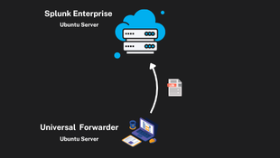
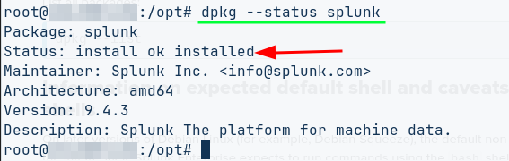

## O que é o Splunk?

Para entender o que é o Splunk, antes você deve entender o que é um SIEM. 

### O que é um SIEM?

Um SIEM - do inglês *Security Information and Event Management* - é uma aplicação que coleta e analiza dados de logs para monitorar atividades críticas de uma organização. Ele faz isso coletando, analisando e reportando através de dados de múltiplas fontes. **Mas como acontece esse processo de coleta e analise?**

Primeiro o SIEM **Coleta e Processa** uma enorme quantidade de dados gerados por dispositivos e sistemas de todo ambiente da organização. Esses dados não são iguais, porque dispositivos geram dados de formatos diferentes. O SIEM tem a capacidade de ler e analisar esses tipos de formatos diferentes através de um processo de **Normalização**. Os *raw datas* - dados brutos - são processados ​​para que sejam formatados de forma consistente e apenas informações relevantes sobre os eventos sejam incluídas. Por fim, o SIEM **Indexa** os dados para que possam ser acessados ​​por meio de consultas. Todos os eventos em todas as diferentes fontes podem ser acessados.

**O Splunk é uma solução de segurança cibernética da empresa Cisco que combina gerenciamento de informações de segurança (SIM) e gerenciamento de eventos de segurança (SEM)**. Ele é usado para coletar, armazenar, analisar e correlacionar dados de logs de diferentes fontes em uma rede, como servidores, dispositivos de rede, firewalls, sistemas de detecção de intrusão e aplicativos em tempo real

## Como instalar e executar o Splunk

### Considerações iniciais

⚠️ esse documento foi criado seguindo somente a documentação oficial fornecida pelo [Splunk](https://docs.splunk.com/Documentation?_gl=1*16526cv*_gcl_au*MTMyNTU1ODM4MS4xNzUwNjEzMjcw*FPAU*MTMyNTU1ODM4MS4xNzUwNjEzMjcw*_ga*MTQyNzI2MTQxNi4xNzUwNjEzMjY5*_ga_5EPM2P39FV*czE3NTA2MTkwOTIkbzIkZzEkdDE3NTA2MTkzNzkkajQ5JGwwJGg5ODQwMDg2MDE.*_fplc*UGt2SjQwaUExRSUyRlNqZUtBTzkzQkRnbHlDU0VscEVnUSUyQkpqUDVjclh5UlhGU1Z5WWIxQnprSjJZREJrQVBoalRDeGFuZklWTEFybUhYejA4VU1MSXNBQTdMazl0N2o0bWN0TUdQNWJBQ2ZTJTJGQTZyVXZRQ0o3aFFLbFcyaDFnJTNEJTNE)

Nesse guia será instalado e configurado o Splunk Enterprise em uma VPS com Linux. Também será instalado um Universal Forwarder em uma maquina virtual com Ubuntu Server para atuar como um "coletor" de logs. Contudo, é possível instalar o Splunk Enterprise e Universal Forwarder em sistemas com Windows, o que muda obviamente é a forma de instalação e configuração.

{: width="972" height="589" .w-50 .right}

Hardware VPS:

- Kernel: 6.8.0-60-generic
- CPU: AMD EPYC Processor CPU @ 2.0GHz 6 core
- Memória RAM: 12gb
- Disco SSD: 200gb

Splunk Enterprise:

- Versão 9.4.3-237

Verifique [aqui](https://help.splunk.com/en/splunk-enterprise/get-started/install-and-upgrade/9.3/plan-your-splunk-enterprise-installation/system-requirements-for-use-of-splunk-enterprise-on-premises) os requisitos de hardware para seu sistema

### Download na página oficial

Visite a página oficial da ferramenta [Splunk](https://www.splunk.com/en_us/download.html) > Selecione Splunk Enterprise Free Trial > faça seu cadastro na plataforma (é obrigatório) > Em seguida faça o Login

⚠️ no campo **Business Email** ele aceita @gmail.com

Escolha o pacote do Splunk de acordo com o sistema operacional. Nesse guia será instalado em um Linux

 Linux:

 ~~~bash
 wget -O splunk-9.4.3-237ebbd22314-linux-amd64.deb "https://download.splunk.com/products/splunk/releases/9.4.3/linux/splunk-9.4.3-237ebbd22314-linux-amd64.deb"
 ~~~

Windows:

 ~~~bash
 wget -O splunk-9.4.3-237ebbd22314-windows-x64.msi "https://download.splunk.com/products/splunk/releases/9.4.3/ windows/splunk-9.4.3-237ebbd22314-windows-x64.msi"
 ~~~

 MacOS:

 ~~~bash
 wget -O splunk-9.4.3-237ebbd22314-darwin-intel.dmg "https://download.splunk.com/products/splunk/releases/9.4.3/ osx/splunk-9.4.3-237ebbd22314-darwin-intel.dmg"
 ~~~
 
 
 

Use o gerenciador de pacotes `DPKG` para instalar o pacote `.deb` baixado

~~~bash
sudo dpkg -i splunk-9.4.3-237ebbd22314-linux-amd64.deb
~~~

- Aguarde a instalação finalizar;

- Verifique o status da instalação com o seguinte comando:

~~~bash
dpkg --status splunk
~~~

- Outra maneira de verificar se deu certo é acessar o diretório `/opt`; Deve existir um diretório chamado `splunk`

### Iniciando o Splunk

- Acesse o diretório `/opt/splunk/bin`

- Execute o comando `./splunk start`

- Primeiro será mostrado um contrato de licenças e coisas similares. Aperte a tecla `Space` até o final do documento. Em seguida aceite os termos com `y` 

- Depois defina um nome de usuário administrador e uma senha 

    ⚠️ anote essas credenciais

- Após criar as credenciais você devera ver uma tela igual essa abaixo. Significa que o webserver está funcionando.

- Você pode acessar o servidor através do localhost, hostname (nome do servidor) ou endereço ip:
    - Se estiver na sua máquina local: http://127.0.0.1:8000
    - Se estiver remoto ou na sua rede local: http://ip ou hostname do servidor:8000

- Insira suas credenciais de acesso criadas anteriormente

## Como configurar

O próximo passo é adicionar uma fonte de dados ao Splunk. Existem muitas formas de fazer isso, nesse guia vou mostrar de duas maneiras: através de dados prontos e através de Universal Forwarders (pense nisso como "coletores" de dados)

### Dados prontos

A documentação oficial fornece dados "prontos" empacotados em arquivos .zip onde contém logs de acesso web, logs de arquivos formatados, logs de arquivos de vendas e listas de preços. Você pode baixar esses arquivos na [documentação oficial](https://help.splunk.com/en/splunk-enterprise/get-started/search-tutorial/9.2/part-1-getting-started/what-you-need-for-this-tutorial#id_00ebcad1_5243_445b_b1f1_e3a49fd8c759__Download_the_tutorial_data_files) 

Ou diretamente do meu repositório no Github

~~~bash
wget https://github.com/repoeduardo/splunk/blob/main/resources/tutorialdata.zip && wget https://github.com/repoeduardo/splunk/blob/main/resources/Prices.csv.zip
~~~

#### Importando os dados no Splunk

- Acesse: *Configurations > Add data > Upload > Select File > agora selecione o arquivo zip*

Após importar o arquivo .zip você poderá ver um alerta dizendo: *Preview is not supported for this archive file, but it can still be indexed*. Não se preocupe com essa mensagem.

*Next > Review > Submit > Start Searching*

- Agora que os dados foram "ingeridos" e indexados pelo Splunk podemos testar a busca de dados

- Acesse a aba de buscas *Search*. Você deve ver essa tela

Vamos testar buscando dados que tem origem do arquivo de `prices.csv.zip` com a seguinte consulta:

~~~txt
source="Prices.csv.zip:*"
~~~

OBS: filtre o tempo por `All Time`

Depois teste novamente com o outro arquivo: `source="tutorialdata.zip:*"`

### Universal Forwarders

O Splunk Universal Forwarder é uma versão otimizada e leve do Splunk Enterprise, projetada para coletar e encaminhar dados de diversas fontes para um servidor Splunk centralizado ou para o Splunk Cloud.
Em outras palavras são como "agentes" coletadores de dados, ideal para coletar dados de sistemas remotos e enviar ao seu Splunk.

#### Instalação em Linux

~~~bash
wget -O splunkforwarder-9.4.3-237ebbd22314-linux-amd64.deb "https://download.splunk.com/products/universalforwarder/releases/9.4.3/linux/splunkforwarder-9.4.3-237ebbd22314-linux-amd64.deb"
~~~

- Após fazer o download do pacote .deb faça a instalação com o gerenciador de pacotes dpkg

~~~bash
sudo dpkg -i splunkforwarder-9.4.3-237ebbd22314-linux-amd64.deb
~~~

- Verifique o status da instalação: `dpkg --status splunkforwarder`

- De acordo com a [documentação oficial](https://help.splunk.com/en/splunk-enterprise/forward-and-process-data/universal-forwarder-manual/9.4/install-the-universal-forwarder/install-a-nix-universal-forwarder#about-installing-with-tar-files-0) é necessário criar um usuário com menos privilégios que o *root* chamado `splunkfwd` por boas práticas de segurança. Essa etapa é opcional, para fazer isso certifique de fazer login como root do sistema e criar um usuário e grupo executando os comandos a seguir:

~~~bash
useradd -m splunkfwd
groupadd splunkfwd
export SPLUNK_HOME="/opt/splunkforwarder"
chown -R splunkfwd:splunkfwd $SPLUNK_HOME
~~~

- Execute o SplunkForwarder

~~~bash
sudo $SPLUNK_HOME/bin/splunk start --accept-license
~~~

#### Configurando Universal Forwarder e o Splunk

- O primeiro passo a se fazer é abrir um porta de escuta do host que irá receber os dados

- Existem diferentes maneiras de fazer isso: através do painel web ou linha de comando. Nesse exemplo irei usar o painel web. Em caso de dúvidas consulte esse [documento oficial](https://help.splunk.com/en/splunk-enterprise/forward-and-process-data/universal-forwarder-manual/9.4/configure-the-universal-forwarder/enable-a-receiver-for-splunk-enterprise#id_8dd83488_23ef_4bc4_94ee_d4ca8aa9cfeb__Enable_a_receiver_for_Splunk_Enterprise)

- No seu Splunk acesse: *Settings > Forwarding and receiving > Configure receiving > New Receiving Port > Adicione a porta e salve (a padrão é 9997)*

- Agora acesse o host que tem o SplunkForwarder instalado e configure para enviar os dados para o *receiver*, o Splunk Enterprise

~~~bash
./splunk add forward-server <ip do Splunk>:<Porta de escuta>
~~~

- Agora você pode monitorar alguns logs, por exemplo para monitorar a pasta `/var/logs` do seu forwarder

~~~bash
./splunk add monitor /var/log
~~~

- Vá até a barra de busca de seu Splunk Enterprise e busque por `*`

## O que fazer agora?

A partir daqui você define quais tipos de dados pretende monitorar. Essa [página](https://help.splunk.com/en/splunk-enterprise/get-started/get-data-in/9.4/introduction/what-data-can-i-index) te ajuda a fazer isso. Por exemplo, você pode subir um software vulnerável onde o Forwarder está instalado para monitorar em tempo real possíveis ataques; você pode montar dashboards de acessos ssh; criar alertas e reports; criar dashboard de máquinas Windows (pra isso você precisa instalar o Forwarder em um Windows).

A partir daqui você pode criar muitos tipos de laboratórios que te ajudam em seu objetivo.

## Referências

- https://docs.splunk.com/Documentation/Splunk/9.4.2/Installation/StartSplunkforthefirsttime

- https://www.splunk.com/en_us/download.html

- https://help.splunk.com/en/splunk-enterprise/get-started/search-tutorial/9.2/part-1-getting-started/what-you-need-for-this-tutorial#id_00ebcad1_5243_445b_b1f1_e3a49fd8c759__Download_the_tutorial_data_files

- https://help.splunk.com/en/splunk-enterprise/forward-and-process-data/universal-forwarder-manual/9.4/install-the-universal-forwarder/install-a-nix-universal-forwarder#bfa92018_7238_476c_8351_2dd1ee65ef8c__Install_the_universal_forwarder_on_Linux

- https://help.splunk.com/en/splunk-enterprise/forward-and-process-data/universal-forwarder-manual/9.4/configure-the-universal-forwarder/enable-a-receiver-for-splunk-enterprise#id_8dd83488_23ef_4bc4_94ee_d4ca8aa9cfeb__Enable_a_receiver_for_Splunk_Enterprise

- https://help.splunk.com/en/splunk-enterprise/forward-and-process-data/universal-forwarder-manual/9.4/configure-the-universal-forwarder/configure-the-universal-forwarder-using-configuration-files

- https://help.splunk.com/en/splunk-enterprise/get-started/get-data-in/9.4/introduction/what-data-can-i-index

