## Overview do laboratório 

O objetivo desse laboratório é aprender a configurar e entender como funciona a detecção de ataques em tempo real utilizando o SIEM [Splunk](https://www.splunk.com/), assim como entender quais procedimentos são adequados para remediar esses ataques. A idéia desse exercício foi colocado em prática após eu compreender conceitos importantes do Framework MITRE ATT&CK, sendo que serão abordadas as técnicas de Bruteforce denominadas [T1110](https://attack.mitre.org/techniques/T1110/) de acordo com o Framework, específicamente *Fuzzing* de diretórios com a ferramenta *Dirb* e bruteforce de senhas contra serviço de SSH utilizando a ferramenta *Hydra*

## Identificando os ativos importantes

A idéia central é parecer ao máximo com o mundo real, portanto, vamos partir do pressuposto que você foi contratado por um cliente que deseja monitar a rede da empresa. O primeiro passo é conhecer a topologia e identificar os ativos mais importantes da empresa. 

💡 Pense em ativos que caso fossem "hackeados" traria muitas consequências negativas a empresa, seja financeira, de confiança, perda de clientes ou perda de reputação 

Alguns exemplos são: Controlador de domínio, propriedade intelectual, sistema de RH, banco de dados, aplicação exposta a internet, fileservers

## Topologia da rede

Após uma reunião com o cliente você constatou que se trata de uma rede simples, onde o principal sistema usado é apenas uma aplicação web usada pelos colaboradores em uma rede local. Para simular essa rede podemos montar o laboratório dessa maneira:

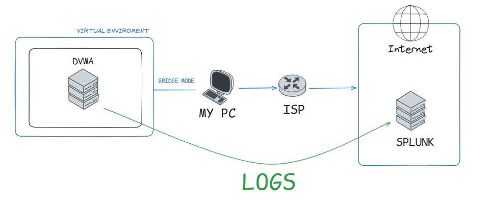

O [DVWA](https://github.com/digininja/DVWA) é uma aplicação feita exclusivamente para ser explorada. Em ambientes empresariais é comum encontrar aplicações Web usadas por colaboradores, algumas inclusives dentro de DMZ e expostas a internet, portanto a função do DVWA aqui é simular uma aplicação web usada pelos colaboradores da empresa. O DVWA será instalado em uma VM Ubuntu Server e receberá IP da minha rede local via modo Bridge. 

Splunk Enterprise para análise de logs e criação de alertas de segurança. Nesse laboratório ele estará hospedado em uma VPS mas fique vontade para instalar o Splunk em sua máquina ou você pode instalar até mesmo em outra VM

⚠️ **Aqui vale ressaltar algo importante:** pode ser interessante monitorar os logs do Firewall, porque apesar de proteger a rede, ele contém informações e visibilidade de todas as conexões que acontece na rede interna. Mas nesse guia vamos pular essa parte

## Configurando o ambiente

Antes de tudo instale as máquinas virtuais que você vai utilizar.

### Instalando o Splunk

Faça a instalação do Splunk Enterprise em um host de sua preferência; em seguida configure os Universal Forwarders nas máquinas alvos para alimentar esse Splunk com dados. Em caso de dúvidas nesse [artigo](https://repoeduardo.github.io/posts/Splunk-Instalacao-Configuracao/) eu ensino como instalar e configurar o Splunk

### Instalando o DVWA

⚠️ Instale o software DVWA em uma máquina virtual, porque é **propositalmente** vulnerável a ataques. Não é recomendável instalar em máquinas reais ou de produção

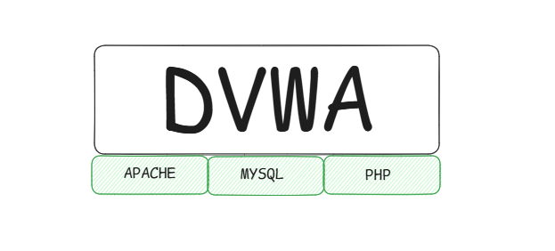

A aplicação necessita de três componentes essenciais para funcionar: **php, servidor web e um banco de dados**. Vamos utilizar o Apache2 e o MySQL como servidor web e banco de dados respectivamente.

Instalando o php, mysql e apache2; Habilitando o serviço do apache2:

~~~bash
sudo apt install -y apache2 php php-mysql mysql-server
sudo systemctl enable apache2
~~~

Verifique se o apache está instalado corretamente acessando a porta 80 do servidor, ou seja, simplesmente jogue o IP no browser

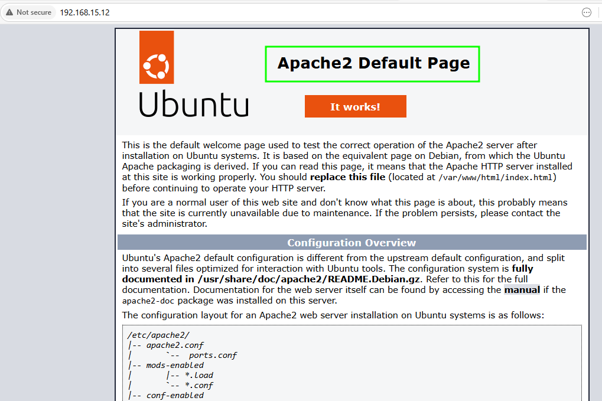

Ou verifique o status do serviço com esse comando: `sudo systemctl status apache2`

Baixe o DVWA do repositório oficial (precisa ter o git instalado); Aplique permissões totais aos diretórios web

~~~bash
cd /var/www/html
sudo git clone https://github.com/digininja/DVWA.git
sudo chown -R www-data:www-data DVWA
sudo chmod -R 777 DVWA
~~~

Acesse o MySQL como root: `sudo mysql` e execute os seguintes comandos:

~~~sql
CREATE DATABASE dvwa;
CREATE USER 'dvwa'@'localhost' IDENTIFIED BY 'p@ssw0rd';
GRANT ALL PRIVILEGES ON dvwa.* TO 'dvwa'@'localhost';
FLUSH PRIVILEGES;
EXIT;
~~~

Agora edite o arquivo de configuração localizado em `/var/www/html/DVWA/config/config.inc.php.dist`

Seguindo essas valores:

~~~php
$_DVWA['db_server'] = 'localhost';
$_DVWA['db_database'] = 'dvwa';
$_DVWA['db_user'] = 'dvwa';
$_DVWA['db_password'] = 'p@ssw0rd';
~~~

Para funcionar a aplicação precisa ler um arquivo de configuração ``.php`` e não ``.dist``; portanto apenas faça uma cópia do arquivo dist para outro com extensão php

~~~bash
sudo cp /var/www/html/DVWA/config/config.inc.php.dist /var/www/html/DVWA/config/config.inc.php
~~~

Você já deve ser capaz de acessar a aplicação em `http://<IP do host>/DVWA`

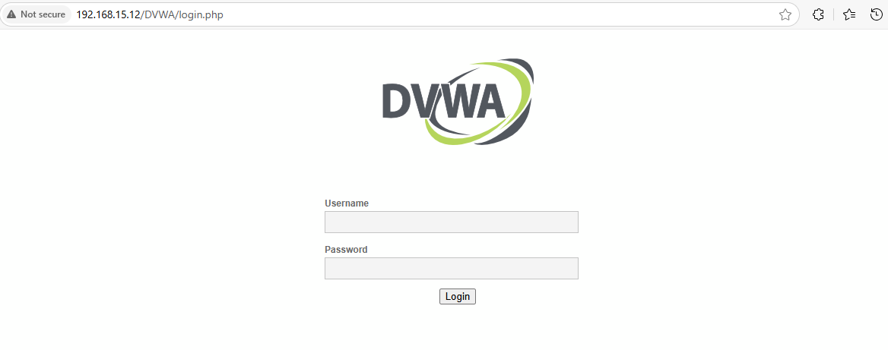

- Credenciais de acesso padrão: `admin / password`

- Clique em ``Create / Reset Database`` na página inicial para reconfigurar o banco.

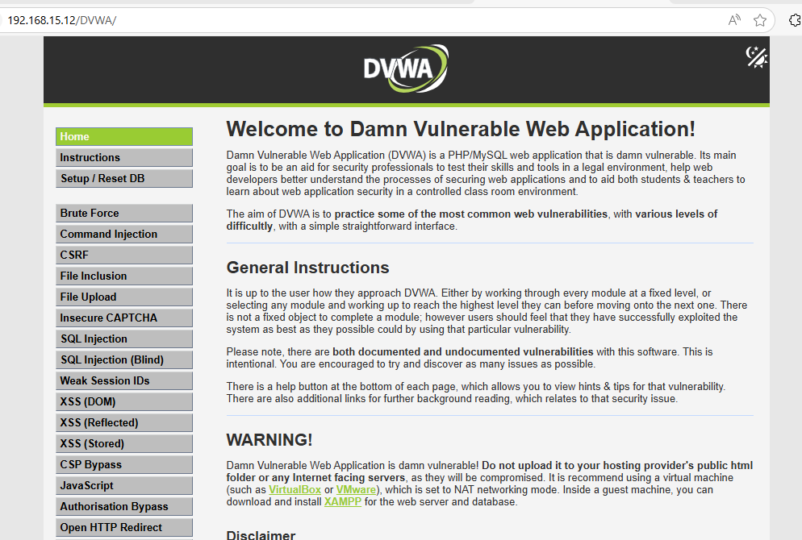

Pronto, temos uma aplicação Web no ambiente 👍

### Enviando logs ao Splunk

O próximo passo é começar a enviar os logs ao Splunk. Um dos requisitos é detectar tentativas de acesso SSH, portanto precisamos ler logs de autenticação do linux que fica nesse diretório: `/var/log/auth.log`; Outro requisito é detectar um possível fuzzing de diretórios na aplicação web, nesse caso os logs do apache2 vai nos ajudar: `/var/log/apache2/access.log`

Adicione esses arquivos ao monitoramento do Splunk:

~~~bash
sudo /opt/splunkforwarder/bin/splunk add monitor /var/log/apache2/access.log -sourcetype apache:access:combined
sudo /opt/splunkforwarder/bin/splunk add monitor /var/log/auth.log -sourcetype linux:audit
~~~

### Melhorando a análise dos logs

Apesar do Splunk receber os logs ele ainda não é capaz de extrair os *fields* - campos - que precisamos para analisar os ataques. Podemos melhorar isso realizando um *parsing* melhor dos logs. Isso é feito através de *regex* ou *Addons* do próprio Splunk

 

**CRIANDO UM REGEX PARA OS LOGS DA CAMADA DE SEGURANÇA DO LINUX**

Por exemplo, para esse alguns logs do arquivo `auth.log` tem um certo padrão de estrutura:

`2025-06-29T00:09:01.608069-03:00 srv-vuln CRON[1634]: pam_unix(cron:session): session closed for user root`

Note que conseguimos ver data-hora, o host, o serviço e um corpo de mensagem.

O seguinte Regex consegue extrair essas informações

~~~txt
^(?P<datetime>\d{4}-\d{2}-\d{2}T\d{2}:\d{2}:\d{2}\.\d{6}-\d{2}:\d{2})\s+(?P<hostname>\S+)\s+(?P<service>[^\s:]+(?:\[\d+\])?):\s+(?P<message>.*)
~~~

Na Aba de Search > Faça uma busca que contenha `sourcetype="linux:audit"` > Procure por *Extract new fields* > I prefer write regular expression my self > Cole a expressão regular > Save > Selecione All Apps > Finish

 

**ADDON PARA LOGS DO APACHE**

*Acesse o Splunk > Apps > Find more apps > Splunk Add-on for Apache Web Server*

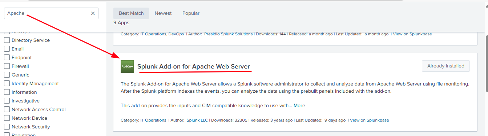

## Purple Team

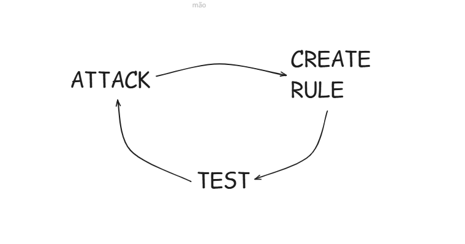

Agora que o ambiente está pronto é possível começar a fase de ataques para analisar como o Splunk se comporta, em seguida criar alertas, e revalidar para garantir que a detecção aconteceu. 

### Brute-force SSH

O ataque de SSH será feito com a ferramenta [Hydra](https://github.com/vanhauser-thc/thc-hydra) usando a wordlist *top-20-common-SSH-passwords.txt* disponível em [SecLists](https://github.com/danielmiessler/SecLists)

💡 Assuma que o usuário do sistema seja `ubuntu`

**Sintaxe:** hydra -l `[user]` -P `[wordlist]` ssh://``[host]``

Realizando o ataque

~~~bash
hydra -l ubuntu -P top-20-common-SSH-passwords.txt ssh://192.168.15.16
~~~

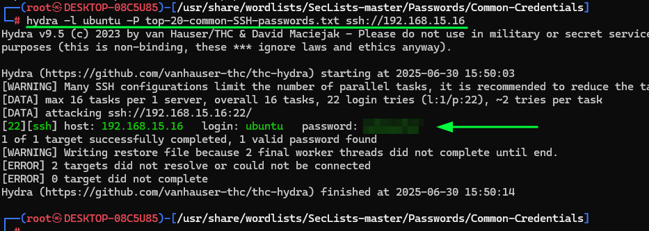

O log gerado quando o usuário erra a senha SSH normalmente contém a frase "Failed password" então para criar a regra precisamos filtrar por ``index=* sourcetype="linux:audit" Failed password``

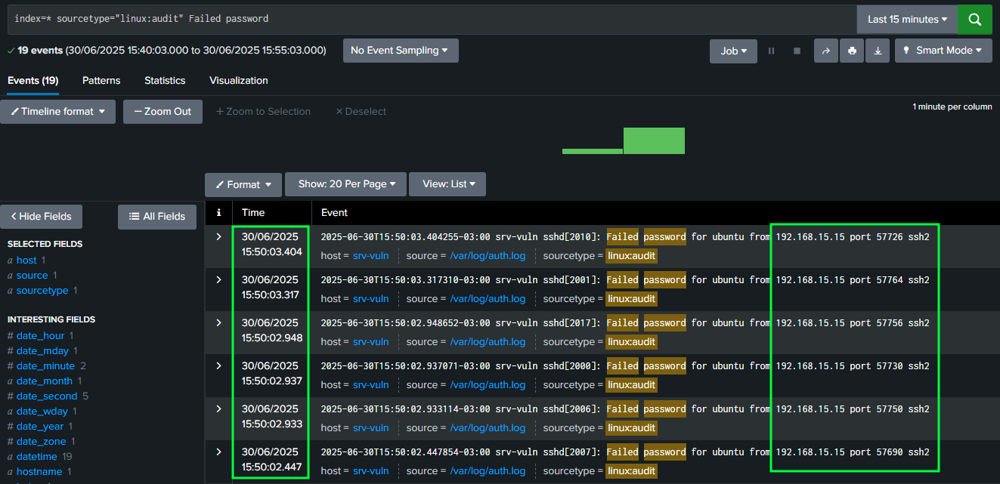

Para ser mais exato a SPL para criar o alerta será esse. Onde depois de 10 tentativas de logins inválidas será disparado o alerta:

~~~txt
index=* sourcetype="linux:audit" Failed password | rex field=message "from\s(?<src_ip>\d{1,3}\.\d{1,3}\.\d{1,3}\.\d{1,3})" | stats count by src_ip host | where count > 10
~~~

 

Cole a SPL na aba de *Search > Save As > Alert* 

- Defina um titulo: ``[T1110] - Brute Force - Linux SSH``

- Permissions: `Shared App`

- Run on Cron Schedule: `*/1 * * * *`  (faz ele verificar a cada 1 minuto)

- No campo Trigger selecione `For Each Result`

- Marque a checkbox Throttle > No campo Suppress results containing field value: `src_ip,host`

- Add Action > Add to Triggered Alerts

Agora refaça o mesmo ataque com o Hydra e verifique se o Splunk detectou o ataque. O resultado deve ser esse:

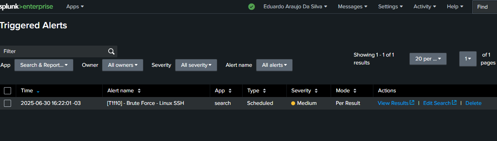

Veja que é retornado IP do atacante e o número de tentativas inválidas nos campos `src_ip e count` respectivamente:

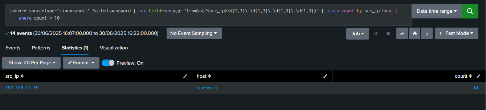

### Brute-force de diretórios

O ataque de brute-force de diretórios será feito com a ferramenta [Dirb](https://dirb.sourceforge.net/)

Sintaxe: `dirb http://<host>`

~~~bash
dirb http://192.168.15.16
~~~

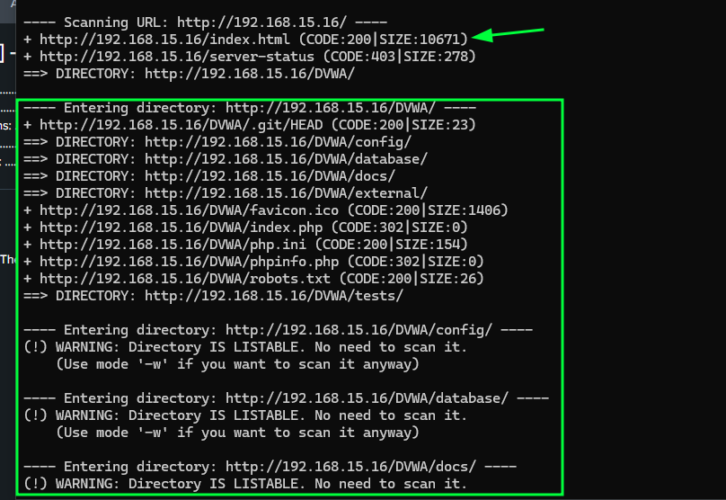

 

Se tratando de servidores web uma das maneiras de entender se é uma tentativa de ataque é olhando o Status Code das requisições HTTP e as URL acessadas

Verificando com Status Code 200 onde é retornado sucesso

~~~txt
index=* sourcetype="apache:access:combined" status=200 | stats count values(url) as url by src
~~~

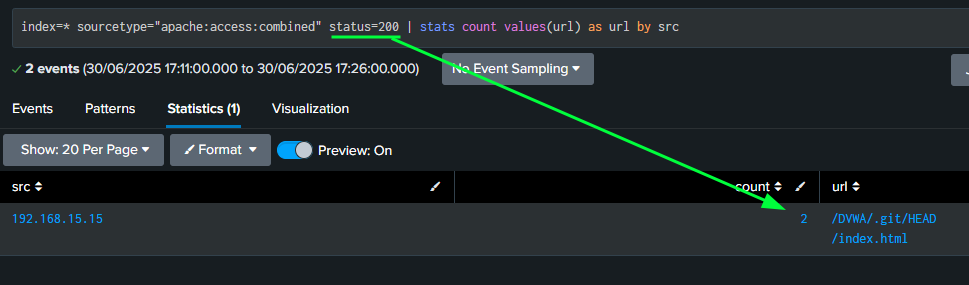

Verificando com Status Code 404 onde é retornado erro por mais de 20 vezes

~~~txt
index=* sourcetype="apache:access:combined" status=404 | stats count values(url) as url by src | where count > 20
~~~

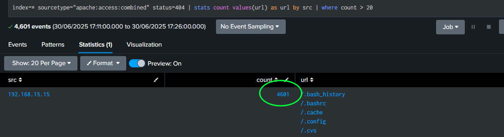

 

Use essa SPL `index=* sourcetype="apache:access:combined" status=404 | stats count values(url) as url by src | where count > 20` para montar um novo alerta, refaça os mesmos passos anteriores. Depois de criar faça o ataque de diretórios novamente e verifique se o alerta foi disparado

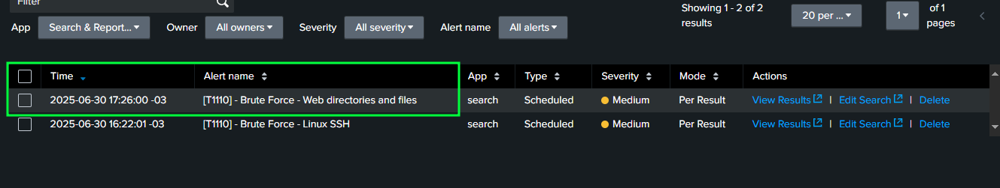

## Plano de resposta a incidente

Meu plano de resposta ao incidente tem como referência as recomendações do [Framework NIST SP 800-61](https://www.nist.gov/privacy-framework/nist-sp-800-61)

Guia detalhado: nesse [link](https://nvlpubs.nist.gov/nistpubs/SpecialPublications/NIST.SP.800-61r2.pdf)

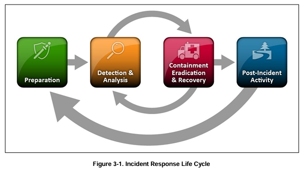

Relatório em [português](https://raw.githubusercontent.com/repoeduardo/repoeduardo.github.io/main/reports/lab-dvwa/relatorio_final.pdf)

Relatório em [inglês](https://raw.githubusercontent.com/repoeduardo/repoeduardo.github.io/main/reports/lab-dvwa/final_report.pdf)

## Referências

- https://www.splunk.com/
- https://attack.mitre.org/
- https://attack.mitre.org/techniques/T1110/
- https://github.com/digininja/DVWA
- https://repoeduardo.github.io/posts/Splunk-Instalacao-Configuracao/
- https://github.com/danielmiessler/SecLists
- https://github.com/vanhauser-thc/thc-hydra
- https://www.nist.gov/privacy-framework/nist-sp-800-61
- https://nvlpubs.nist.gov/nistpubs/SpecialPublications/NIST.SP.800-61r2.pdf

