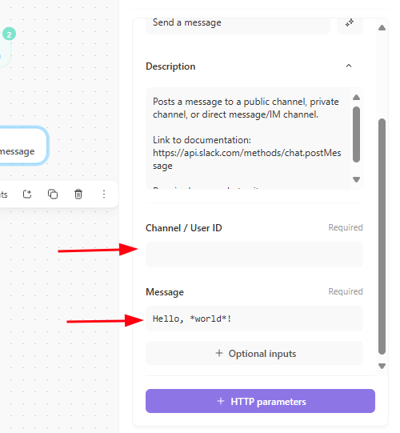

## Objetivo

A criação desse *projeto/laboratório* teve como objetivo aprender habilidades importantes que um analista de segurança precisa ter, como por exemplo: criação de regras de detecção e respostas através de EDRs, criação de processos automatizados - *os playbooks* - integrado a canais de mensagens - *Slack* - e disparo de emails. Além disso, compreender as capacidades de resposta que um EDR pode oferecer ao ambiente, caso uma ameaça seja detectada. Como parte adicional, foi criado uma automação para disparo de mensagens em um canal do Slack sobre alertas de criação, exclusão e elevação de privilégios recebidos por um usuário no Active Directory monitorados pelo Splunk

## Apresentação

Nesse projeto será utilizado como host de teste um Windows Server instalado em VPS. O SOAR (Security Orchestration, Automation, and Response) que será utilizado nesse projeto será o [Tines](https://www.tines.com/). O EDR (Endpoint detection and response) será o [Limacharlie](https://limacharlie.io/use-cases/edr). 

O usuário vai executar um software - que nesse caso trataremos como uma possível ameaça - chamado [LaZagne](https://github.com/AlessandroZ/LaZagne), logo em seguida nosso EDR vai detectar a execução desse programa e enviar dados ao SOAR, que de imediato acionará um playbook que: 

- Envia um e-mail contendo as informações sobre a detecção;
- Envia mensagem em um canal no Slack contendo as informações sobre a detecção;
- Gera uma página com um prompt perguntando se o usuário quer isolar a máquina da rede, um simples SIM ou NÃO. Caso a resposta seja sim, é enviado uma resquisição POST ao agente instalado no host indicando que queremos isolar ele da rede. Caso a resposta seja não, apenas passamos uma mensagem pelo Slack indicando que a máquina não foi isolada.

Como uma parte adicional (mas não obrigatório) vamos configurar o Splunk - um SIEM - para monitorar e alertar sobre alguns eventos de segurança importantes que acontecem dentro do Active Directory e passar as informações desse evento para um canal do Slack

## Parte prática: Construindo o laboratório

**Parte principal**

- Instalação e configuração do Limacharlie
- Instalação do LaZagne
- Criando regra de detecção e resposta no Limacharlie
- Integração do Limacharlie ao Tines
- Integração do Slack ao Tines
- Tines: Configurando envio de mensagens ao canal do Slack
- Tines: Configurando o envio de emails
- Tines: Prompt de resposta ao incidente (tomada de decisão do usuário para isolar ou não a máquina)
- Teste final do playbook

**Parte adicional**

- Configuração do Splunk Forwarder
- Criando alertas
- Enviando alertas ao Tines
- Envio de mensagens ao canal do Slack

### Pré-requisitos

- Ter pelo menos uma máquina Windows que servira como "cobaia" de testes
- Ter conta criada nas plataformas do Slack, Tines e Limacharlie

### Ponderação importante

- Ao invés de usar uma VPS você pode usar uma VM
- Ao invés de usar o Windows Server você pode usar uma versão normal do Windows, porém isso afetará apenas a parte adicional desse projeto, específicamente sobre a configuração de como o Splunk receberá os eventos de segurança. Se for o caso, pesquise por conta própria a melhor maneira de montar as consultas SPL

## Limacharlie - EDR

**Foi dito anteriormente que Limacharlie é um EDR. Mas o que é um EDR afinal?**

De modo bem simplificado um EDR (Endpoint Detection and Response) é uma solução de segurança que atua como um agente que monitora em tempo real atividades suspeitas, com o objetivo de detectar, investigar e responder a ameaças. O Limacharlie oferece visibilidade de processos, serviços, pacotes, informações de rede, informações de usuários, timeline de eventos, e até permite executar comandos remotamente. Além de possuir integração com conjuntos de regras gerenciados e envio de telemetria de dados para plataformas de terceiros (para um SOAR por exemplo)

### Como instalar no host

- Acesse [https://limacharlie.io/](https://limacharlie.io/) e cria uma conta
- Crie uma chave de instalação e baixe o sensor (o agente)
  - *Sensors > Installation Keys > Create Installation Key*

Link direto para baixar o Sensor para sistemas Windows 64 bits:

[https://downloads.limacharlie.io/sensor/windows/64](https://downloads.limacharlie.io/sensor/windows/64)

A documentação deixa bem claro como fazer a instalação

Abra seu terminal como Administrador, vá até o diretório onde está o executável, e execute o seguinte comando:

~~~powershell
lc_sensor.exe -i YOUR_INSTALLATION_KEY
~~~

A chave de instalação você copia da coluna *Sensor Key*

A partir de agora você deve ser capaz de receber informações do seu endpoint: *Acesse Sensors > Sensor List > Clique no nome do seu computador*

## LaZagne

⚠️ RECOMENDAÇÃO: DESATIVE O ANTIVÍRUS DO WINDOWS

O LaZagne é um software de código aberto usado para recuperar diversas senhas armazenadas em um computador local. Foi desenvolvida com o objetivo de encontrar essas senhas

Baixe o executavel no [repositorio oficial](https://github.com/AlessandroZ/LaZagne) na seção de *releases*

Após executar o software no servidor, veja que ele encontrou a senha de um cliente OpenVPN que está instalado na máquina

## Regra de detecção e respostas no Limacharlie

No limacharlie na seção de Timeline filtre por "Lazagne", você deve ser capaz de ver os novos processos detectados pelo Limarcharlie após a execução do software

No Limacharlie acesse *Automation > D&R Rules > Add rule* 

A criação de regras é divida em duas etapas: detecção e resposta. 

### Detecção

Você pode inspecionar o novo processo criado quando o LaZagne é executado, veja que possui algumas caracteristicas

Estamos interessados em processos existentes - ``EXISTING_PROCESS`` - e novos processos - `NEW_PROCESS` - que possam conter esse Hash específico gerado pelo software, também podemos filtrar pelos valores do ``FILE_PATH`` e ``COMMAND_LINE`` que contém o nome do software: LaZagne

~~~yml
events:
  - NEW_PROCESS
  - EXISTING_PROCESS
op: and
rules:
  - op: is windows
  - op: or
    rules:
      - case sensitive: false
        op: ends with
        path: event/FILE_PATH
        value: LaZagne.exe
      - case sensitive: false
        op: contains
        path: event/COMMAND_LINE
        value: LaZagne
      - case sensitive: false
        op: is
        path: event/HASH
        value: 3cc5ee93a9ba1fc57389705283b760c8bd61f35e9398bbfa3210e2becf6d4b05
~~~

### Resposta

~~~yml
- action: report
  metadata:
    author: SecLab
    description: Test - Detects Lazagne Usage
    falsepositives:
      - ToTheMoon
    level: high
    tags:
      - attack.credential_access
  name: SecLab - HackTool - Lazagne
~~~

Outros exemplos de detecção: [https://docs.limacharlie.io/v2/docs/detection-and-response-examples](https://docs.limacharlie.io/v2/docs/detection-and-response-examples)

- Para validar execute o LaZagne novamente;
- Acesse a seção de *Detections*

## Integrando Limarcharlie ao Tines

O próximo passo é enviar essas telemetrias de dados detectados pelo Limacharlie ao Tines para começar a criar as automações

- Acesse o https://www.tines.com/ e crie uma conta

- Crie um novo webhook. Copie o Webhook URL

Agora que temos um Webhook que "escuta" requisições no Tines, podemos usar o recurso do Limacharlie chamado `Outputs` para enviar os dados de detecção que o EDR captura

Acesse seu *LimaCharlie > Outputs > Add Output > Detections > Tines*

- Campo `Name`; Insira um nome, exemplo: SecLab-EDR
- Campo `Destination`; Cole a URL do Webhook copiado anteriormente do Tines
- Clique em Save Output

Para validar:

- Execute novamente o programa ``LaZagne.exe``;
- O Limacharlie vai detectar a atividade através da regra que criamos;
- Em seguida ele enviará esses dados para nosso Webhook do Tines;

## Integração com Slack

⚠️ Primeiro acesse seu Slack, em seguida acesse o Tines novamente e se autentique no Slack para garantir ao Tines autorização para acesso ao seu Workspace. Use esse [guia](https://explained.tines.com/en/articles/8713184-slack-authentication-guide) como suporte

No Tines procure pelo componente do Slack na seção de *Templates > Send a message*

- Opcional mas recomendável: Acesse o Slack e crie um canal próprio para receber alertas.

- Em seguida copie o ID do canal e cole no campo `Channel/User ID` que o Tines solicita

Acesse seu canal criado. O ID do canal fica na URL após a última barra

~~~url
https://app.slack.com/client/VR31ÇÇ0Q7B2/SEU_ID
~~~

- No campo `Message` é onde você escreve o conteúdo da mensagem

- Os dados enviados pelo EDR Limacharlie são capturados por um webhook, ficam no `body` da requisição. 

- No meu caso, no campo da mensagem vou deixar da seguinte maneira

~~~txt
*NEW DETECTION*

Title: <<limacharlie_detection.body.cat>>
Time: <<limacharlie_detection.body.routing.event_time>>
Computer: <<limacharlie_detection.body.routing.hostname>>
Internal IP: <<limacharlie_detection.body.routing.int_ip>>
Command: <<limacharlie_detection.body.detect.event.COMMAND_LINE>>
File Path: <<limacharlie_detection.body.detect.event.PARENT.FILE_PATH>>
Sensor ID: <<limacharlie_detection.body.routing.sid>>
Detection link: <<limacharlie_detection.body.link>>  
~~~

## Opcional: envio de e-mail

No tines procure pelo componente de *Send Email*

- No campo Recipients você adiciona a lista de e-mails que receberá a mensagem

- No campo Reply to: você pode adicionar seu e-mail

- No campo Sender Name: é o nome que aparecerá como 'quem enviou' o e-mail

- No campo Subject é sobre o assunto do e-mail

- No campo Body é o conteúdo do e-mail de fato, em formato HTML. No meu caso deixei dessa forma:

~~~html
Title: <<limacharlie_detection.body.cat>>
 
Time: <<limacharlie_detection.body.routing.event_time>>
 
Computer: <<limacharlie_detection.body.routing.hostname>>
 
Internal IP: <<limacharlie_detection.body.routing.int_ip>>
 
Command: <<limacharlie_detection.body.detect.event.COMMAND_LINE>>
 
File Path: <<limacharlie_detection.body.detect.event.PARENT.FILE_PATH>>
 
Sensor ID: <<limacharlie_detection.body.routing.sid>>
 
Detection link: <<limacharlie_detection.body.link>> 
 
~~~ 

O resultado final deve ser semelhante a esse:

## Prompt para isolar a máquina da rede

Agora vamos criar uma página para o usuário determinar como ele deseja lidar com a "ameaça"

- No Tines selecione o componente Page em *Tools > Page*

- Em seguida clique em *Edit Page*

- Nessa parte você pode customizar a página a sua maneira. No meu caso basicamente tem os seguintes componentes

  - Um **Heading**: NEW DETECTION
  - Um **Rich Text**: na campo de `content` eu mostro os dados recebidos do EDR para contextualizar melhor o usuário
  - Um **Boolean**: que possui dois botões, para capturar a decisão do usuário
  - Um **botão**: apenas para confirmar a decisão tomada

- Após finalizar a customização da página será necessário ler a escolha do usuário. Pra isso podemos adicionar o componente do Tines chamado Trigger que nos permite criar regras e caso essa regra seja verdadeira ele realiza outra ação: por exemplo, caso o usuário decida por não isolar a máquina podemos apenas mandar uma mensagem no Slack dizendo algo no sentido "a máquina não foi isolado, por favor investigue"

- Depois adicione outro componente de Trigger e crie uma regra para caso o usuário decida por isolar a máquina ele realizar outra ação. Nesse caso, podemos fazer uma requisição de para o Limarcharlie isolar a máquina e depois enviar uma mensagem ao Slack dizendo "a máquina foi isolada da rede"

**Configurando autenticação ao Limacharlie**

Importante salientar que para isolar a máquina da rede precisamos fazer uma requisição ao Limacharlie e passar o valor do SID (Sensor ID) que fica na requisição capturada pelo Webhook do Tines

- Antes de tudo acesse a página principal do *Limacharlie > Access Managment > REST API > Copie a Org JWT*

- Agora acesse seu Tines na seção de *Credentials > New > Manual Credentials > Text > Cole o JWT no campo Value*

- Volte ao seu Workflow > Procure pelo template do Limacharlie novamente > Procure e selecione por "Isolation Sensor"

- Configure a autenticação criada com JWT > Conecte ele ao Trigger > Conecte ele a outro componente de Slack para enviar mensagem ao canal

**Teste final**

Agora execute novamente o *LaZagne.exe > Acesse a página do Prompt > Selecione YES > Acesse o Limacharlie > Sensor List > Selecione o máquina > Overview* 

- Veja que aparece `Isolated`
- Clicando em `Rejoin network` a máquina volta a estar disponível na rede

## Parte adicional: Monitorando atividades no Active Directory

- Primera etapa: instale o Splunk, esse [artigo](https://repoeduardo.github.io/posts/Splunk-Instalacao-Configuracao/) pode ajudar.

### Configurações importantes do Splunk Enterprise

- **Ajuste o Time Zone do Splunk para a região que você mora:** 
  - User > Preferences > Time Zone

- **Instale um Addon para Windows:**
  - Apps > Find more apps > Instale o app "Splunk Add-on for Microsoft Windows"

- **Configure o Splunk para receber dados:**
  - Settings > Forwarding and receiving > Configuring receiving > New receiving Port > 9997

- **Crie um novo Indexer (opcional):**
  - Settings > Indexes > New indexer > "seclab"

### Configurações importantes do Splunk Forwarder

- Configure o Splunk Forwarder para apontar para o IP do Splunk Enterprise na porta 9997

- Abra o arquivo ``inputs.conf`` como Administrador localizado em *C:/Program Files/SplunkUniversalForwarder/etc/system/local/inputs.conf*

Adicione as seguintes linhas ao final do arquivo

~~~txt
[WinEventLog://Security]
index = seclab
disabled = false
~~~

- Em seguida acesse o *Serviços* do Windows e reinicie o serviço do SplunkForwarder

- Acesse o Splunk Enterprise e filtre na aba de Search por `index=seclab`; Em seguida você deverá ver os logs do Forwarder sendo coletados.

- Caso não veja, libere a regra no firewall do OS ao qual o Splunk Enterprise está instalado

### Criando alertas

Iremos capturar três eventos relacionados ao usuário:

- **Quando um usuário for criado dentro do Active Directory:** isso gera um Event Code 4724 nos logs do Windows

  O alerta será criado com base nessa SPL

  ~~~spl
  index=seclab EventCode=4724
  | eval search_time=_time
  | join type=left user
      [ search index=seclab EventCode=4720
        | eval create_time=_time
        | table user, create_time ]
  | eval age_in_seconds = search_time - create_time
  | where isnull(create_time) OR age_in_seconds > 300
  | stats count by _time, Subject_Account_Name, user, Subject_Account_Domain
  ~~~

- **Quando um usuário for excluído do Active Directory:** isso gera um Event Code 4726 nos logs do Windows

  O alerta será criado com base nessa SPL

  ~~~spl
  index=seclab EventCode=4726 | stats count by _time, Subject_Account_Name, user, ComputerName
  ~~~

- **Quando um usuário for incluído ao grupo dos Administradores do Active Directory, simulando uma possível escalação de privilégios**

  O alerta será criado com base nessa SPL

  ~~~spl
  index=seclab EventCode=4728 OR EventCode=4732 OR EventCode=4756
  | eval TargetGroup=coalesce(Target_Group_Name, Group_Name)
  | search TargetGroup="*Administrators*" OR TargetGroup="*Domain Admins*"
  | table _time, EventCode, TargetGroup,user, Subject_Account_Name, Subject_Account_Domain
  ~~~

 

 

- No Tines crie um novo Webhook
- Copie a URL do Webhook
- Cole essa URL no momento da criação dos alertas no Splunk. Você deverá adicionar na parte de Trigger > Add Action

- Agora chega em uma parte importante. Conecte uma componente Trigger ao Webhook e crie uma regra com base no valor de `search_name` que chega no corpo da requisição

- O valor "User created" não deve ser qualquer coisa. Ele deve ser igual ao valor que chega na requisição. O Splunk pega esse valor do título do alerta que foi criado

- No meu caso decidi fazer essa simples estrutura, como se fosse um `if-else`

- Teste todos os alertas. Por exemplo, aqui vou fazer um teste deletando um usuário do domínio

- Ao fazer isso o Splunk captura e gera um alerta. Em seguida aciona o Webhook do Tines, que por sua vez cai na Trigger de "User was deleted" e envia a mensagem no chat do Slack

## Conclusão

Ao final do projeto seu Playbook final deve ficar parecido com isso:

## Referências

- https://www.tines.com/
- https://limacharlie.io/use-cases/edr
- https://docs.limacharlie.io/docs/api-keys#getting-a-jwt
- https://github.com/AlessandroZ/LaZagne
- https://docs.limacharlie.io/v2/docs/detection-and-response-examples
- https://explained.tines.com/en/articles/8713184-slack-authentication-guide
- https://www.ultimatewindowssecurity.com/securitylog/encyclopedia/

