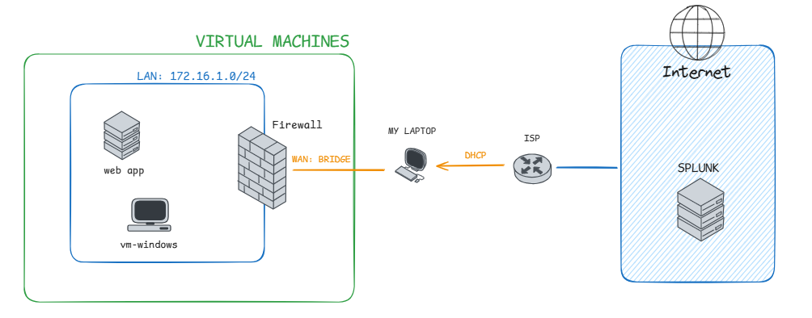

# DOCUMENTAÇÃO DO PROJETO

## ESTRATÉGIA DE DEFESA

### O QUE SÃO AS JÓIAS DA COROA

No contexto de segurança de dados as jóias da coroa são os ativos mais importantes da empresa, muitas vezes são esses ativos que sustentam a organização. Exemplo: em uma instituição financeira isso seria o banco de dados que contém informações dos clientes, histórico de transações e saldos bancários.

Pense em ativos que caso fossem "hackeados" traria muitas consequências negativas a empresa, seja financeira, de confiança, perda de clientes, perda de reputação e etc. 

#### EXEMPLOS DE JÓIAS DA COROA

- Controlador de domínio

- Banco de dados

- Aplicação exposta a internet

- Propriedade intelectual 

- Servidores de email corporativo

- Sistema de recursos humanos

## TOPOLOGIA DO LABORATÓRIO

    OBS: A vm-windows não é um controlador de domínio

**Analisando a disposição da rede consegue identificar os principais ativos?** 

Aqui podemos inferir que os principais ativos - nessa topologia - são a Aplicação Web (normalmente aplicações web contém banco de dados) e o Firewall (apesar de proteger a rede, ele contém informações e visibilidade de todas as conexões que acontece na rede interna)

## CONFIGURAÇÃO DO NTP

Configure o Firewall como servidor NTP. Aplique as configurações de todas as interfaces de rede (WAN, LAN, DMZ e etc) apontando para os seguintes servidores brasileiros:

- a.st1.ntp.br

- b.st1.ntp.br

- c.st1.ntp.br

----------

### ubuntu

/etc/systemd/timesyncd.conf  

#!/bin/sh
# Reinstalar systemd-timesyncd
sudo apt install --reinstall systemd-timesyncd
# Ativar NTP
sudo timedatectl set-ntp true
# Verificar status
sudo systemctl status systemd-timesyncd
# Testar conectividade NTP
ntpdate -q 172.16.0.254

## INSTALAÇÃO DO DVWA

sudo apt install -y apache2 php php-mysql mysql-server
sudo systemctl enable apache2
sudo systemctl status apache2

cd /var/www/html
sudo git clone https://github.com/digininja/DVWA.git
sudo chown -R www-data:www-data DVWA
sudo chmod -R 777 DVWA

CREATE DATABASE dvwa;
CREATE USER 'dvwa'@'localhost' IDENTIFIED BY 'p@ssw0rd';
GRANT ALL PRIVILEGES ON dvwa.* TO 'dvwa'@'localhost';
FLUSH PRIVILEGES;
EXIT;

sudo nano /var/www/html/DVWA/config/config.inc.php.dist

$_DVWA['db_server'] = 'localhost';
$_DVWA['db_database'] = 'dvwa';
$_DVWA['db_user'] = 'dvwa';
$_DVWA['db_password'] = 'p@ssw0rd';

sudo cp /var/www/html/DVWA/config/config.inc.php.dist /var/www/html/DVWA/config/config.inc.php

Clique em Create / Reset Database na página inicial para configurar o banco.
Faça login com as credenciais padrão: admin / password

## CONFIGURANDO LOGS

/splunk add monitor /var/log/apache2/access.log -sourcetype apache:access:combined
/splunk add monitor /var/log/auth.log -sourcetype linux:audit

## ENVIANDO LOGS DO PFSENSE

Acesse o pfSense > Status > System logs > Settings > Marque *Send log messages to remote syslog server*

OBS: O pfSense envia os logs na porta UDP, então você precisa abrir uma porta no seu Splunk. Nesse tutorial será usado a porta 12513

No campo *Remote log servers* insira 173.249.20.206:12513

Acess o Splunk > Data Inputs > UDP Inputs > New Port > Insira a porta > Next > Defina um novo Sourcetype: `pfsense`

## PARSING LOGS

Parsing de logs é o processo de analisar e interpretar os registros ou "logs" produzidos por sistemas computacionais para extrair informações uteis

Addon pro Apache

Apps > Find more apps > Splunk Add-on for Apache Web Server

Para logs da camada de segurança do Linux (auth.log) vamos criar um Regex na mão

Por exemplo, para esse log:

`2025-06-29T00:09:01.608069-03:00 srv-vuln CRON[1634]: pam_unix(cron:session): session closed for user root`

Recomendação do professor
~~~regex
^(?P<datetime>\w{3}\s+\d{1,2}\s+\d{1,2}:\d{2}:\d{2})\s+(?P<hostname>\S+)\s+(?P<service>\S+):\s+(?P<message>.*)
~~~

or 

~~~regex
^(?P<datetime>\d{4}-\d{2}-\d{2}T\d{2}:\d{2}:\d{2}\.\d{6}-\d{2}:\d{2})\s+(?P<hostname>\S+)\s+(?P<service>[^\s:]+(?:\[\d+\])?):\s+(?P<message>.*)
~~~

Na Aba de Search > Faça uma busca que contenha `sourcetype="linux:audit"` > Procure por *Extract new fields* > I prefer write regular expression my self > Cole a expressão regular > Save > Selecione All Apps > Finish

## MITRE ATT&CK

Exercícios de Purple Team é basicamente um ciclo:  Ataque -> Criar regra -> Teste de efetividade -> Ataque -> Criar regra -> Teste de efetividade...

`nc -vz -w 1 192.168.15.16 21,22,23,25,53,80,110,111,135,139,143,443,445,993,995,1723,3306,3389,5900,8080`

`nmap -p 21,22,23,25,53,80,110,111,135,139,143,443,445,993,995,1723,3306,3389,5900,8080 192.168.15.16`

## BRUTE FORCE

Com base em um brute force SSH feito com Hydra

SPL de detecção:

~~~spl
index=* sourcetype="linux:audit" Failed password | rex field=message "from\s(?<src_ip>\d{1,3}\.\d{1,3}\.\d{1,3}\.\d{1,3})" | stats count by src_ip host | where count > 10
~~~

## ENUMERAÇÃO DE DIRETÓRIOS

Com base em um ataque de enumeração de diretórios com Dirb

Se tratando de servidores WEB uma das maneiras de entender se é uma tentativa de ataque é olhando o Status Code das requisições HTTP e as URL acessadas

~~~spl
index=* sourcetype="apache:access:combined" status=404 | stats count values(url) as url by src
~~~

## SQL Injection

~~~http
/DVWA/login.php?username=eduardo&password=edauaro&Login=Login&user_token=0c495ee74a83d3a1646a50bc15811b86
~~~

Injection

~~~bash
sqlmap -u "http://<target>/DVWA/login.php" --method=POST --data="username=eduardo&password=edauaro&Login=Login&user_token=0c495ee74a83d3a1646a50bc15811b86" -p username,password --level=3 --risk=3
~~~